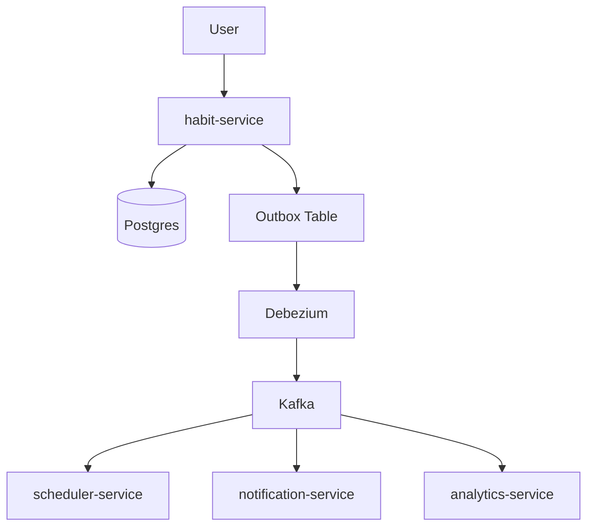
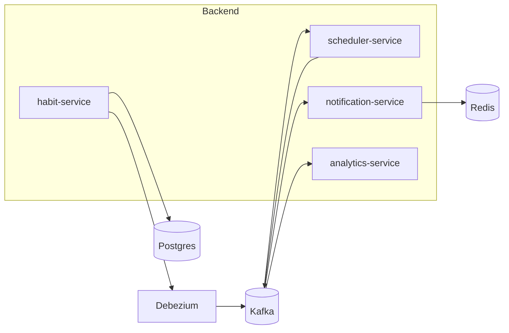
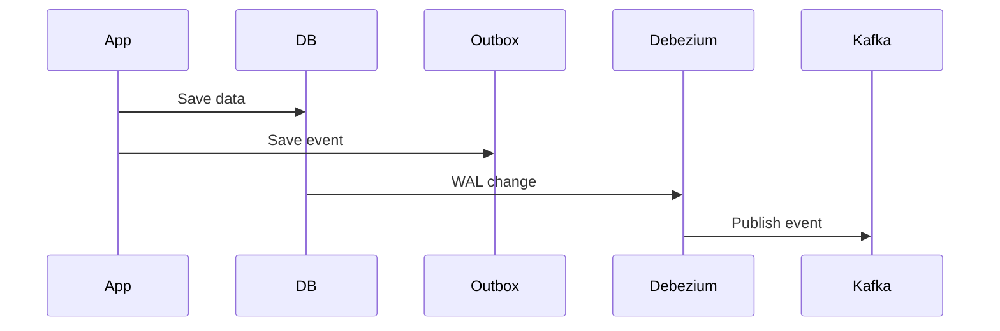

# 🐶 COXA

  
  
  


**Care Orchestration & eXperience for Animals**

COXA is an event-driven system designed to manage pet health through asynchronous events, scheduling, and intelligent notifications.

---

# 🚀 Motivation

Managing recurring pet medications (like deworming or flea treatments) can be error-prone.

COXA solves this by:

- automating reminders
    
- tracking medication history
    
- reacting to events instead of manual workflows
    

---

# 🧠 Architecture Overview

## Event Flow



---

## High-Level Architecture



---

# 🧩 Services

### 🟢 habit-service

Handles:

- medication creation
    
- medication execution
    

Events:

- `MedicationCreated`
    
- `MedicationScheduled`
    
- `MedicationGiven`
    

---

### 🟡 scheduler-service

Handles:

- time-based triggers
    
- overdue detection
    

Events:

- `MedicationDue`
    
- `MedicationOverdue`
    

---

### 🔵 notification-service

Handles:

- event reactions
    
- notifications (log-based in MVP)
    

---

### 🟣 analytics-service

Handles:

- history
    
- metrics
    
- timeline reconstruction
    

---

# 🏗️ Monorepo Structure

```bash
/coxa
├── backend/
│   ├── services/
│   │   ├── habit-service/
│   │   ├── scheduler-service/
│   │   ├── notification-service/
│   │   └── analytics-service/
│   │
│   └── shared/
│       ├── events/
│       ├── infra/
│       └── database/
│
├── frontend/
│   └── web-app/
│
├── infra/
│   ├── docker-compose.yml
│   ├── kafka/
│   ├── debezium/
│   ├── postgres/
│   ├── redis/
│   └── prometheus/
│
└── README.md
```

---

# ⚙️ Tech Stack

## Backend

- Go (Golang)
    
- PostgreSQL
    
- Redis
    
- Apache Kafka
    
- Debezium
    

## Frontend

- React
    
- Vite
    
- TailwindCSS
    

## Observability

- Prometheus
    
- Grafana
    

---

# 🧱 Architectural Patterns

## Event-Driven Architecture (EDA)

- asynchronous communication
    
- loosely coupled services
    
- event-based workflows
    

## Clean Architecture

- domain is independent
    
- business logic isolated
    

## Hexagonal Architecture (Ports & Adapters)

- inbound adapters (HTTP, Kafka)
    
- outbound adapters (DB, Kafka, Redis)
    

---

# 📦 Outbox Pattern



---

# 📡 Event Examples

## MedicationCreated

```json
{
  "event_id": "uuid",
  "event_type": "MedicationCreated",
  "aggregate_id": "med-123",
  "payload": {
    "name": "Antiflea",
    "frequency_days": 60
  },
  "created_at": "2026-01-01T10:00:00Z"
}
```

---

# 🔁 Idempotency

- Redis tracks processed events
    
- prevents duplicate processing
    
- ensures reliable event handling
    

---

# 📊 Observability

COXA includes a full observability stack using Prometheus and Grafana.

## Architecture

```mermaid
graph TD
    A[Services] --> B[/metrics endpoint]
    B --> C[Prometheus]
    C --> D[Grafana Dashboard]
```

---

## Metrics

Each service exposes a `/metrics` endpoint.

Examples:

- `events_processed_total`
    
- `event_processing_duration_seconds`
    
- `notifications_sent_total`
    
- `notifications_failed_total`
    

---

## Prometheus

- Collects metrics via scraping
    
- Stores time-series data
    
- Runs at: [http://localhost:9090](http://localhost:9090/)
    

---

## Grafana

- Visualizes metrics
    
- Dashboards for:
    
    - event throughput
        
    - service latency
        
    - error rates
        

👉 Access:  
[http://localhost:3000](http://localhost:3000/)  
login: admin / admin

---

## Tracing (Correlation ID)

All events include:

```json
{
  "event_id": "uuid",
  "correlation_id": "uuid"
}
```

This allows tracking event flow across services.

---

## Logging

Structured logs include:

- service name
    
- event_id
    
- correlation_id
    
- processing status
    

---

# 🐳 Running Locally

```bash
docker compose up -d --build
```

---

# 🚀 Roadmap

### Phase 1

- habit-service
    
- scheduler
    
- notification logs
    

### Phase 2

- MedicationGiven flow
    
- rescheduling
    

### Phase 3

- analytics
    
- timeline
    

### Phase 4

- retries
    
- idempotency
    
- failure handling
    

---

# ⚖️ Trade-offs

### Pros

- scalability
    
- resilience
    
- decoupling
    

### Cons

- complexity
    
- eventual consistency
    
- harder debugging
    

---

# 🐶 Fun Fact

The name **COXA** comes from the author's dog 🐕  
(Coxinha, or just “Coxa”)

---

# 📄 License

MIT