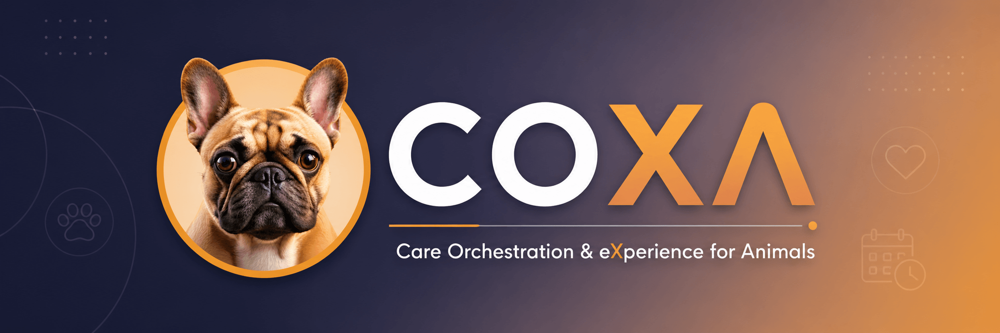
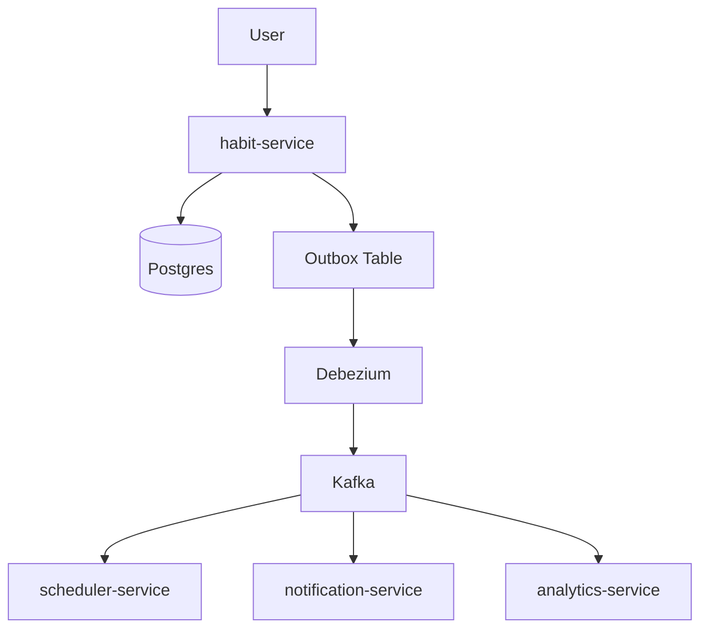
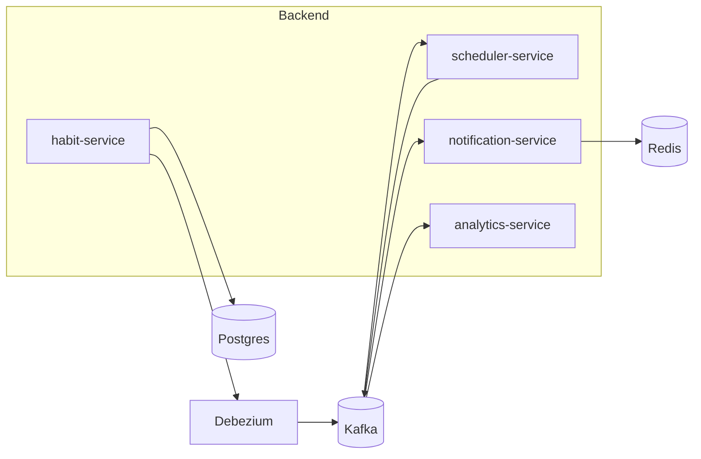
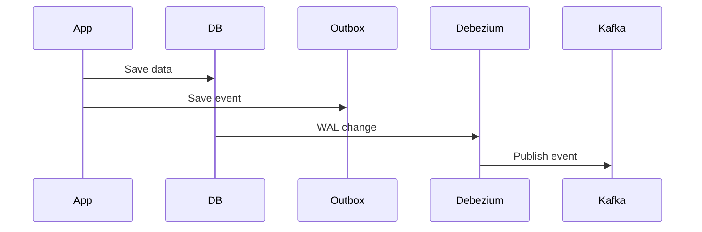
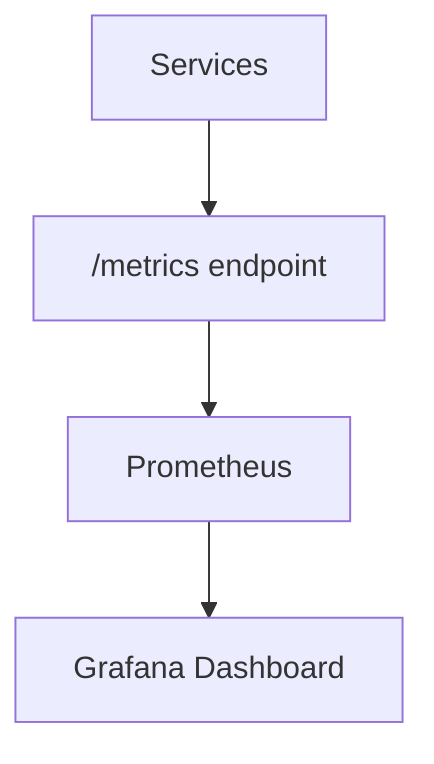

# COXA (Care Orchestration & e**X**perience for Animals)

  

COXA is an event-driven system designed to manage pet health through asynchronous events, scheduling, and intelligent notifications.

---

## 🚀 Motivation

Managing recurring pet medications (like deworming or flea treatments) can be error-prone.

COXA solves this by:

- automating reminders
    
- tracking medication history
    
- reacting to events instead of manual workflows
    

---

## 🧠 Architecture Overview

### Event Flow



---

### High-Level Architecture



---

## 🧩 Services

### 🟢 habit-service

Handles:

- medication creation
    
- medication execution
    

Events:

- `MedicationCreated`
    
- `MedicationScheduled`
    
- `MedicationGiven`
    

---

### 🟡 scheduler-service

Handles:

- time-based triggers
    
- overdue detection
    

Events:

- `MedicationDue`
    
- `MedicationOverdue`
    

---

### 🔵 notification-service

Handles:

- event reactions
    
- notifications (log-based in MVP)
    

---

### 🟣 analytics-service

Handles:

- history
    
- metrics
    
- timeline reconstruction
    

---

## 🏗️ Monorepo Structure

```bash
/coxa
├── backend/
│   ├── services/
│   │   ├── habit-service/
│   │   ├── scheduler-service/
│   │   ├── notification-service/
│   │   └── analytics-service/
│   │
│   └── shared/
│       ├── events/
│       ├── infra/
│       └── database/
│
├── frontend/
│   └── web-app/
│
├── infra/
│   ├── docker-compose.yml
│   ├── kafka/
│   ├── debezium/
│   ├── postgres/
│   ├── redis/
│   └── prometheus/
│
└── README.md
```

---

## ⚙️ Tech Stack

### Backend

- Go (Golang)
    
- PostgreSQL
    
- Redis
    
- Apache Kafka
    
- Debezium
    

### Frontend

- React
    
- Vite
    
- TailwindCSS
    

### Observability

- Prometheus
    
- Grafana
    

---

## 🧱 Architectural Patterns

### Event-Driven Architecture (EDA)

- asynchronous communication
    
- loosely coupled services
    
- event-based workflows
    

### Clean Architecture

- domain is independent
    
- business logic isolated
    

### Hexagonal Architecture (Ports & Adapters)

- inbound adapters (HTTP, Kafka)
    
- outbound adapters (DB, Kafka, Redis)
    

---

## 📦 Outbox Pattern



---

## 📡 Event Examples

### MedicationCreated

```json
{
  "event_id": "uuid",
  "event_type": "MedicationCreated",
  "aggregate_id": "med-123",
  "payload": {
    "name": "Antiflea",
    "frequency_days": 60
  },
  "created_at": "2026-01-01T10:00:00Z"
}
```

---

## 🔁 Idempotency

- Redis tracks processed events
    
- prevents duplicate processing
    
- ensures reliable event handling
    

---

## 📊 Observability

COXA includes a full observability stack using Prometheus and Grafana.

### Architecture



---

### Metrics

Each service exposes a `/metrics` endpoint.

Examples:

- `events_processed_total`
    
- `event_processing_duration_seconds`
    
- `notifications_sent_total`
    
- `notifications_failed_total`
    

---

### Prometheus

- Collects metrics via scraping
    
- Stores time-series data
    
- Runs at: [http://localhost:9090](http://localhost:9090/)
    

---

### Grafana

- Visualizes metrics
    
- Dashboards for:
    
    - event throughput
        
    - service latency
        
    - error rates
        

👉 Access:  
[http://localhost:3000](http://localhost:3000/)  
login: admin / admin

---

### Tracing (Correlation ID)

All events include:

```json
{
  "event_id": "uuid",
  "correlation_id": "uuid"
}
```

This allows tracking event flow across services.

---

### Logging

Structured logs include:

- service name
    
- event_id
    
- correlation_id
    
- processing status
    

---

## 🐳 Running Locally

```bash
docker compose up -d --build
```

---

## 🚀 Roadmap

### Phase 1

- habit-service
    
- scheduler
    
- notification logs
    

### Phase 2

- MedicationGiven flow
    
- rescheduling
    

### Phase 3

- analytics
    
- timeline
    

### Phase 4

- retries
    
- idempotency
    
- failure handling
    

---

## ⚖️ Trade-offs

### Pros

- scalability
    
- resilience
    
- decoupling
    

### Cons

- complexity
    
- eventual consistency
    
- harder debugging
    

---

## 🐶 Fun Fact

The name **COXA** comes from the author's dog 🐕  
(Coxinha, or just “Coxa”)

---

## 🤖 AI-Assisted Development

This project was built using modern AI-Assisted Software Development practices.

| | |
|---|---|
| IDE/Agent | VSCode with GitHub Copilot |
| Primary Model | Claude Haiku 4.5 |
| Strategic Support | GitHub Copilot (GPT-based) |
| Methodology | Event-Driven Development (EDD) |

The development followed an event-driven approach, where the entire system architecture and patterns (EDA, Outbox Pattern, CDC with Debezium, Idempotency with Redis) were designed to be event-centric. AI was utilized to assist in architecture refinement, documentation generation, implementation planning, and code development—all under human review and validation.

### 📋 Project Specifications

The functionalities of COXA were planned and organized through comprehensive architecture and design documents located in the `/docs` folder. These documents include:

- **ARCHITECTURE.md** - Core architectural patterns and design decisions:
  - Event-Driven Architecture (EDA) principles
  - Outbox Pattern implementation with CDC
  - Idempotency strategy using Redis
  - Complete medication flow timeline
  - Failure scenarios and recovery mechanisms
  
- **PROJECT_STRUCTURE.md** - Real project structure and organization:
  - Folder hierarchy and file purposes
  - Service implementation pattern (single `main.go` per service)
  - Shared infrastructure components
  - How to extend the project with new services

- **SETUP.md** - Detailed setup and configuration guide:
  - Prerequisites and installation steps
  - Local development environment
  - Health checks and validation
  - Troubleshooting common issues

- **DEVELOPMENT.md** - Developer workflow and tools:
  - Local service development
  - Debugging techniques
  - Kafka, PostgreSQL, and Redis operations
  - Testing procedures

- **TESTE_END_TO_END.md** - Comprehensive end-to-end testing:
  - Step-by-step medication flow validation
  - Integration point verification
  - Metric collection in Prometheus
  - Dashboard visualization in Grafana

- **CONTRIBUTING.md** - Contribution guidelines:
  - Code standards and best practices
  - How to add new services
  - Testing requirements
  - Pull request process

### 📚 Documentation

**Recommended reading order for new developers:**

1. **README.md** (this file) - *1-2 min*
   - Understand the motivation and purpose of COXA

2. **SETUP.md** - *5-10 min*
   - Get the system running locally and verify health

3. **ARCHITECTURE.md** - *15-20 min*
   - Understand the architectural patterns and design decisions
   - Study complete event flow timeline
   - Review failure recovery mechanisms

4. **PROJECT_STRUCTURE.md** - *10-15 min*
   - Navigate the codebase structure
   - Understand the implementation pattern
   - Learn how to find relevant code

5. **DEVELOPMENT.md** - *reference*
   - Development tools and commands
   - Debugging and logging procedures
   - Local testing approaches

6. **TESTE_END_TO_END.md** - *15 min*
   - Validate system with practical tests
   - Verify Prometheus metrics collection
   - Explore Grafana dashboards

7. **CONTRIBUTING.md** - *reference*
   - Contribution guidelines
   - How to add new services
   - Code standards

Each document builds upon the previous one, creating a comprehensive understanding of the system from conceptual architecture to practical implementation.

---

## 📄 License

MIT